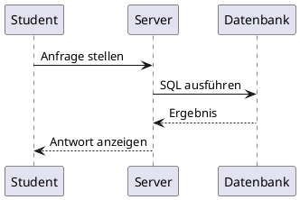
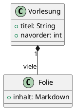

title=Diagramme
navorder=04
~~~~~~

# Diagramme mit PlantUML

[TOC]

_Diagramme beschreibst Du als Text – daraus entsteht beim Erstellen der Website automatisch eine Grafik. Kein Zeichenprogramm, keine externe Software nötig._


<div class="nextpage"></div>

## So funktioniert es

Setze den Diagramm-Quelltext in einen Codeblock aus drei Backticks und schreibe direkt hinter die öffnenden Backticks das Sprachkürzel `plantuml`. Beim Erstellen der Website wird der Block durch eine fertige Grafik ersetzt – Du selbst siehst im Ergebnis nur das Bild.

Die Diagramme werden lokal gerendert (mit PlantUMLs Smetana-Layout, also ohne Graphviz). Unveränderte Diagramme werden bei erneutem Bauen übersprungen.


<div class="nextpage"></div>

## Beispiel: Sequenzdiagramm

Quelltext:

```
@startuml
Student  -> Server:    Anfrage stellen
Server   -> Datenbank: SQL ausführen
Datenbank --> Server:  Ergebnis
Server   --> Student:  Antwort anzeigen
@enduml
```

Ergebnis:




<div class="nextpage"></div>

## Beispiel: Klassendiagramm

Quelltext:

```
@startuml
class Vorlesung {
  +titel: String
  +navorder: int
}
class Folie {
  +inhalt: Markdown
}
Vorlesung "1" *-- "viele" Folie
@enduml
```

Ergebnis:




<div class="nextpage"></div>

## Mehr Diagrammtypen

PlantUML beherrscht weit mehr als diese beiden Beispiele: Anwendungsfall-, Aktivitäts-, Zustands-, Komponenten- und Entity-Relationship-Diagramme und einiges mehr. Alle folgen demselben Muster – Quelltext zwischen `@startuml` und `@enduml`, eingefasst in einen `plantuml`-Codeblock.
