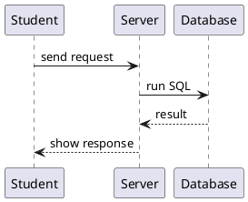
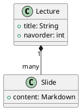

title=Diagrams
navorder=04
~~~~~~

# Diagrams with PlantUML

[TOC]

_You describe diagrams as text – a graphic is produced from it automatically when the website is built. No drawing program, no external software required._


<div class="nextpage"></div>

## How it works

Put the diagram source into a code block of three backticks and write the language tag `plantuml` right after the opening backticks. When the website is built, the block is replaced by a finished graphic – in the result you only see the image.

The diagrams are rendered locally (with PlantUML's Smetana layout, i.e. without Graphviz). Unchanged diagrams are skipped on a rebuild.


<div class="nextpage"></div>

## Example: sequence diagram

Source:

```
@startuml
Student  -> Server:   send request
Server   -> Database: run SQL
Database --> Server:  result
Server   --> Student: show response
@enduml
```

Result:




<div class="nextpage"></div>

## Example: class diagram

Source:

```
@startuml
class Lecture {
  +title: String
  +navorder: int
}
class Slide {
  +content: Markdown
}
Lecture "1" *-- "many" Slide
@enduml
```

Result:




<div class="nextpage"></div>

## More diagram types

PlantUML can do far more than these two examples: use-case, activity, state, component and entity-relationship diagrams, and more. They all follow the same pattern – source between `@startuml` and `@enduml`, wrapped in a `plantuml` code block.
